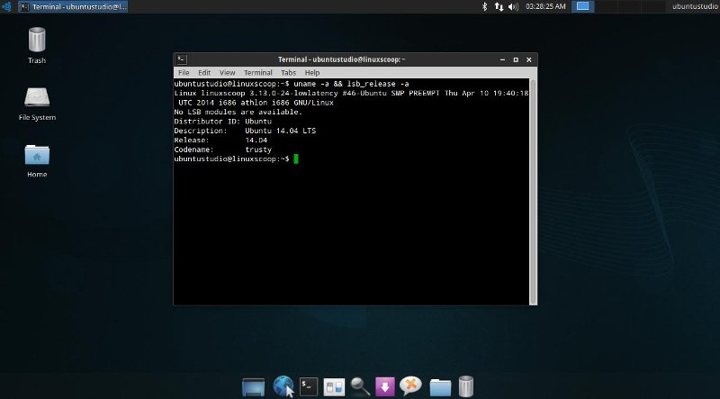

## Terminal / Console:

Terminal (or console) is a tool for running commands on the computer in an “old school” way. It looks something like this:



When these instructions tell you to type something the terminal, the expectation is that you’ll press enter after typing in the command.

---

Let’s test and make sure that the Python interpreter works/exists:

---

1. Open the terminal (follow the instructions for your operating system):
  * Linux (Cubbli)
    * Menu -> Terminal
    * or: bottom row: Terminal-icon
    * or: Ctrl+Alt+t
  * Windows:
    * Start -> Command Prompt (or Komentokehote)
  * Mac:
    * Open the Console command line tool from Applications->Utilities->Console
2. Type `python3`
  * You should see something like this:  
  ```Python 3.4.3 (default, Nov 17 2016, 01:08:31)
  [GCC 4.8.4] on linux
  Type "help", "copyright", "credits" or "license" for more information.
  >>>
  ```
  * If nothing happens, try typing just `python`
  * Leave Python by typing `quit()`
  * You can close the terminal window whenever you want. Nothing will break.
