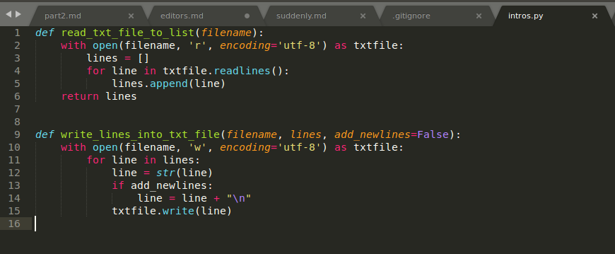

# Text editors for coding

There's a wide choice of editors that have been developed with coding specifically in mind. Many of those are both free and good. A few alternatives are:

* [SublimeText](https://www.sublimetext.com/)
* [Atom](https://atom.io/)
* [Light Table](http://lighttable.com/)

Whatever you choose will boil down to preference and taste. All of the above are good choices, and definitely more pleasant to work with than the basic text editors we started with. The most obvious benefit is automatic highlighting of different elements of code, which will make reading and writing it a lot easier:

