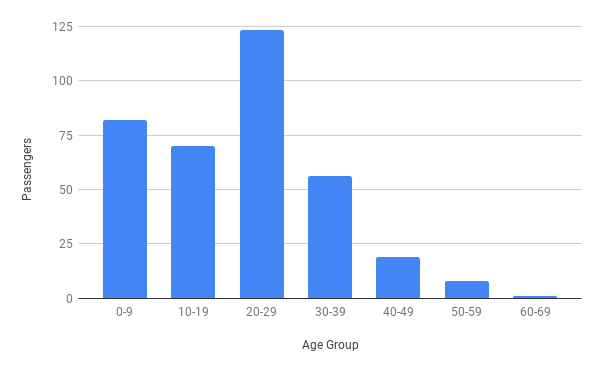

# Demographics of Immigration to New York in 19th c.

## Getting the data

Find passenger lists for immigrants to United Staes during the Irish famine at https://aad.archives.gov/aad/

> ___Browse by Category___  
> Genealogy/ Personal History  
> * Casualties  
> * Civilians  
> * Military Personnel  
> * **Passenger Lists**  
> * Prisoners of War  

https://aad.archives.gov/aad/series-description.jsp?s=639&cat=GP44&bc=,sl&col=1002

### Download a table

Find a way to download a complete passanger manifest:
1. Find a journey to review from the list of ships to arrive.
2. Download the passanger record for that ship.

## Start coding! (But plan each step first)

### Read the data in Python

Read the csv into list of dictionary entries. Each row (passenger) should be a dictionary in the list.
- Use the csv library (**DictReader** seems handy here!) see https://docs.python.org/3/library/csv.html on how to do that.
- Check that your code does what it shoud. It helps to run the script with Python left running (do this with `python -i your_script.py`).

### Refine the data

Update the dictionary created from the csv file with additional data that we'll use for statistics:
- You'll want to iterate over the list of passengers you previously created and add a new key to each dictionary there with the values you'll produce here.
    - Remember the `for item in list:` -structure? That's what you'll be using here.
- Create an 'age' key in each dictionary and add an integer there with the passenger's age.
    - It's easiest to do this with a small function: The function takes the content of the 'AGE' -field as input (eg. "age 52") and takes the last two characters of that string, converts them to an integer and returns that value.
    - Iterate over each individual passenger dictionary in the passenger list, retrieve the 'AGE' -value in that dictionary, and pass it to the function you just created. Add the output of that function to a new key in the dictionary (for example 'age_int').
- Check that your code does what it shoud. It helps to run the script with Python left running (do this with `python -i your_script.py`).

### First statistics

Create your first statistical overview of the ship! Total the amount of passenger in each 10 year age group: (0-9, 10-19, 20-21, ...)

There are quite a few ways to do this- here's one:
1. As above, add additional key to each passenger dictionary: 'age_group'.  
   Create a function that takes a passenger's age as input (this would be the age -integer we created previously) and outputs the age group that age belongs to.
   * You'll want to round the age down to nearest 10 (so 0, 10, 20, 30, etc...)
   * You have to do really simple math to accomplish this. Some hints:
   * Imagine someone with age of 24 ...
   * Try giving the `int()` function a decimal number, say `2.4`. What's the output?
   * What do you when multiplying that by 10?
2. Now, create a dictionary for the age group totals with the keys [0, 10, 20, 30, 40, 50, 60, 70, 80, 90], each each holding the value 0.
   * Iterate over the passenger list, and get the passenger's age group.
   * Add one to the dictionary you just created at the corresponding age group's key. So, if the passenger's age group is 20, add one to the value held at the age group totals dictionary's key 20.
   * There's shorthand for adding one to a value. Here it would look like this: `age_group_dict[age_group] += 1` This does exactly the same as `age_group_dict[age_group] = age_group_dict[age_group] + 1`
   * Again, inspect the resulting dictionary in Python to make sure it makes sense.

### Create an output file

We have our first statistics! Let's write that as a new csv file now. Have a look at https://docs.python.org/3/library/csv.html#csv.writer for how to do that (or see below).

We'll want to have a header row in the csv with 'age_group' and 'amount' and then a row for each age group and the corresponding amount of passengers. 

Here's sample code for outputting the csv with `csv.writer`:

```python
passenger_age_groups_outfile = "age_group_totals.csv"
with open(passenger_age_groups_outfile, 'w') as outfile:
    csvwriter = csv.writer(outfile)
    csvwriter.writerow(['age_group', 'total'])
    for key in age_groups_dict.keys():
        csvwriter.writerow([key, age_groups_dict[key]])
```

Open the resulting csv on Google sheets and create a graph out of it. The csv should look like this: [age_group_totals_example.csv](./age_group_totals_example.csv).  
And the bar plot (with Google Sheets) should look like this:



### More statistics

How many people in each age group are part of a family, and how many are travelling alone? It looks like each family is grouped in the passenger lists, so we can add additional key to each passenger's dictionary to check if thay are travelling with a family or not.

Create another function to determine that. The function should take 3 inputs: The family name of the passenger to check and the family names of the passenger on the row above and the row below. If the passenger's family name is the the same as the one either below or above we'll assume they are part of a family. Make the family -value a boolean (`True` or `False`).
- To get the previous and next family name you'll have to iterate over the passenger list by index, like so: `for i in range(0, length(passenger_list)):`. Then inside the loop, retrieve each passenger's dictionary from the list with `passenger_list[i]` -- and their family name with `passenger_list[i]['LAST NAME']`. With that same logic, the next passenger's family name can be retrieved with `passenger_list[i + 1]['LAST NAME']`. 
- You'll notice that the first and last rows are special cases, as they don't have a family name for the person on the previous or next row. You'll need to cover these with `if` -statements.

Once you have the family status for each passenger, create another statistical overview.
- As previously, create a dictionary to hold the results.
- Unlike previously, instead of keeping just one value for each age group, make a dictionary of dictionaries like this: `{'family':0, 'non_family':0}`, and grow the value that corresponds with the passenger in question. So, if the passenger is part of a family, you would do something like this: `age_groups_dict[age_group]['family'] += 1` and if not: `age_groups_dict[age_group]['non_family'] += 1`.

### More outputs

Finally, output the new more finely grained statistic as another csv file. You can do this by copying and modifying the previous csv output code.

Create another graph and marvel the results. Test how your code works with another ships passenger list.
